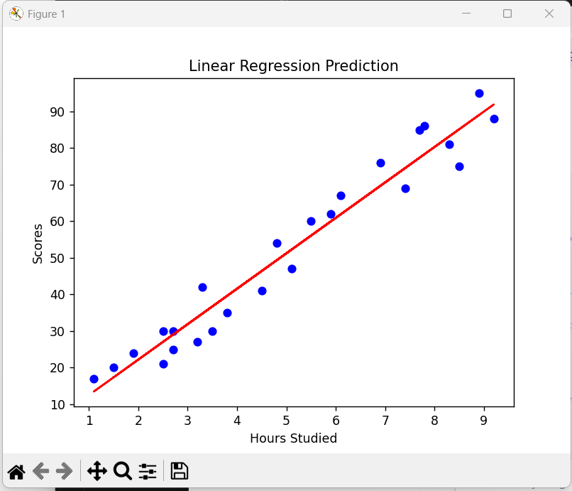
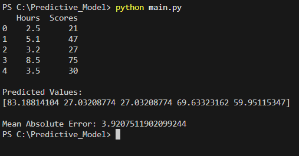

# Student Score Prediction Using Machine Learning

This project predicts student scores based on study hours using Linear Regression.

## Technologies Used
- Python
- Pandas
- Matplotlib
- Scikit-learn

## Algorithm Used
- Linear Regression

## Features
- Data visualization
- Model training
- Predictions
- Error evaluation

## Output Graph

## Terminal Output

## Author
Priya
